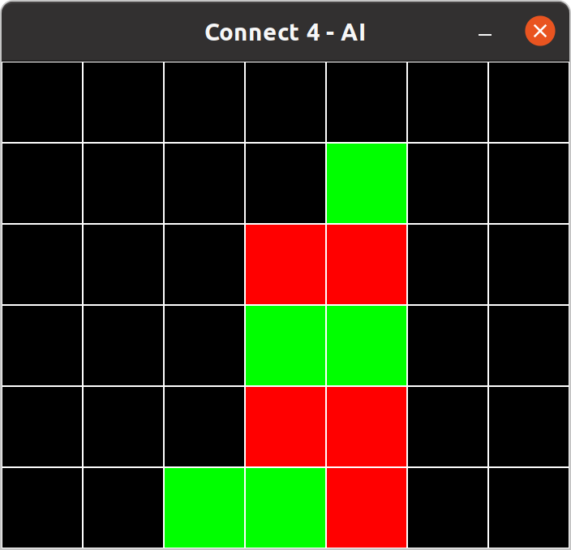

# Connect4
A Connect Four (Four in a row) graphical interface with AI. The game is playable by running main.py, using "python main.py".

The AI is based on mini-max with alpha-beta pruning.
Dependencies required are numpy and pygame.